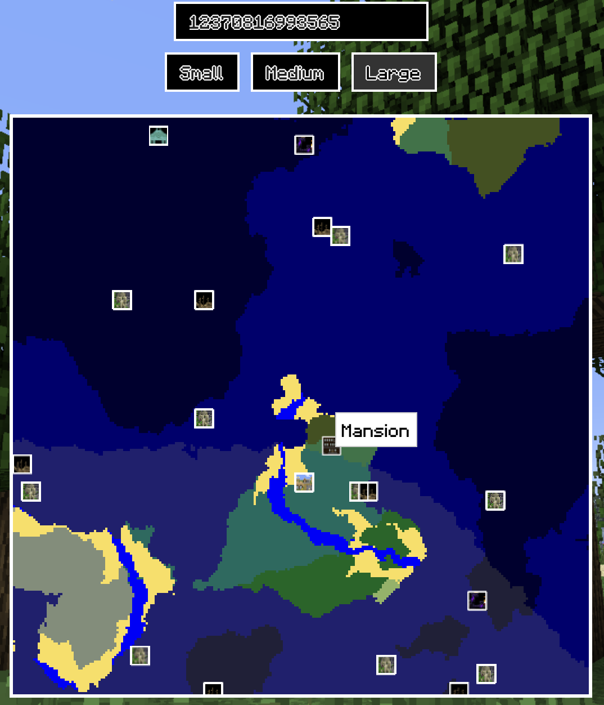

# Minecraft World Generator



## Usage

Start the project:

```sh
npm run dev
```

Build the project:

```sh
npm run build
```

Preview the project:

```sh
npm run build && npm run preview
```

## Credits

- [Cubiome](https://github.com/Cubitect/cubiomes) - C implementation of the algorithm
- [MCP-Reborn](https://github.com/Hexeption/MCP-Reborn) - view Minecraft's source code
- [Minecraft terrain generation in a nutshell](https://www.youtube.com/watch?v=CSa5O6knuwI) - Minecraft's world generation algorithm overview

## License

MIT
